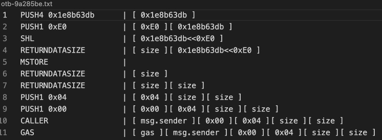

### Hardhat plugin for translate opcodes to bytecode

You can translate contract bytecode to opcodes and watch what is in the stack.




### Installation

**Step 1:** Install the package

`npm i @sovaslava/hardhat-otb`

**Step 2:** Add to your hardhat.config.ts file

`import "@sovaslava/hardhat-otb";`

### Usage

### --help:

```shell
npx hardhat otb --help
```

#### result:

```shell
Usage: hardhat [GLOBAL OPTIONS] otb --file <STRING> [--stack <STRING>]

OPTIONS:

  --file        path to file with opcodes
  --stack       write stack into other file

otb: Opcodes to bytecode
```

### converting mnemonic opcodes into bytecode string:

Prepare text file with opcodes, each opcode with args in separated line. Let it be `opcodes.txt`. You can choose any other name:

```shell
PUSH1 0x42
PUSH1 0
MSTORE
PUSH1 32
PUSH1 0
RETURN
```

```shell
npx hardhat otb --file opcodes.txt
```

In console you can see bytecode:

```shell
604260005260326000f3
```

### --stack feature:

default value for --stack option - false

```shell
npx hardhat otb --file opcodes.txt --stack true
```

the `otb-*.txt` file will be created in the project directory:

```shell
PUSH1 0x42            | [ 0x42 ]
PUSH1 0x00            | [ 0x00 ][ 0x42 ]
MSTORE                |
PUSH1 0x32            | [ 0x32 ]
PUSH1 0x00            | [ 0x00 ][ 0x32 ]
RETURN                |
```
